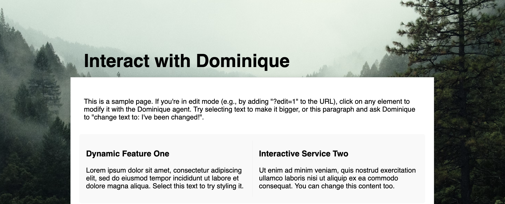
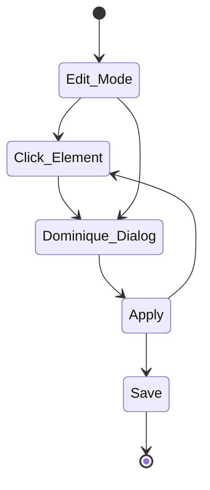
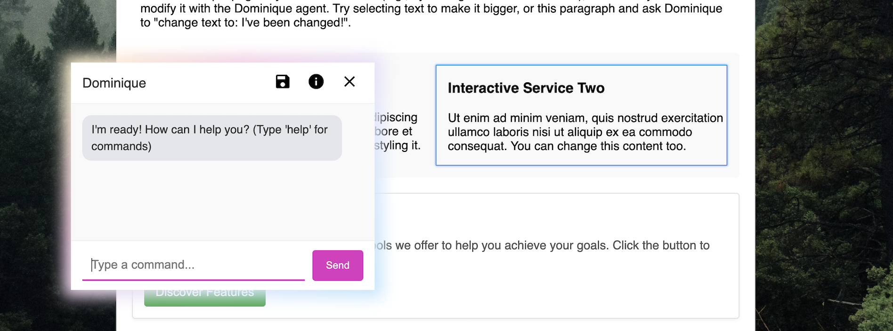

# Dominique - the oneend agent

You know those website builders made for small business owners?
Pick a theme. Drop in blocks. Accordion. Image next to text. Call to action. Maybe a testimonial slider. Everything configurable without touching code. Sounds good in theory.

<!-- more -->

<figure markdown="span">
  { loading=lazy }
  <figcaption>Demo website</figcaption>
</figure>

But spend five minutes with one and it gets old. Too many settings. Too much UI. Every little thing wrapped in a form. Want to adjust spacing? Hope it’s in the advanced tab. Want to change tone or rephrase something? Open the right block, find the field, maybe. It’s editing with gloves on, and you can feel it.

---

## Foundation

The idea comes from the experience of building websites with traditional CMS systems. These systems often require a complex setup, including a backend, API, and preview mode. This can be time-consuming and frustrating for developers and content creators alike.

Dominique aims to simplify the process of editing and updating websites by providing a live-editable interface directly in the browser. This eliminates the need for a backend GUI, making it easier to make changes without going through a complex process.

Also AI is already used in every editor for lingustic task, rewrite in simple language, find synonyms, and replace them with more direct ones. Check sentiment of the paragraph and so on.

## Oneend

I wanted something simpler. So I built **Oneend**.

It’s still just a static site. Plain HTML. But when you flip it into edit mode, the entire page becomes live-editable. Click any element, and Dominique shows up. She’s an AI agent trained to work directly on the DOM. You tell her what you want:

    > Make this text more direct
    > Add a note about support
    > Turn this into a list
    > Increase font size

She updates the DOM immediately. No preview. No detour. No backend. You’re editing the real page. Finish edit mode (save), and the result is written out as a new static file. That’s your site now.

<figure markdown="span">
  { loading=lazy }
  <figcaption>Dominique in action</figcaption>
</figure>

---

## Conclusion

Because I am tired of systems that turn content editing into a process for the user. No backend, no preview mode, no accordion block configuration panel with five tabs. Dominique is a oneend prototype. It is for single sites that need to change fast, without going through huge devops process. Just your site, you and Dominique, in the browser. An editable romance.

[Dominique code on GitHub](https://github.com/rebeling/dominique) and the repo as [Github page demo](https://rebeling.github.io/dominique/)
