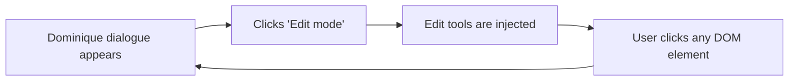

# Edit Your Website with Dominique

You know those website builders made for small business owners?
Pick a theme. Drop in blocks. Accordion. Image next to text. Call to action. Maybe a testimonial slider. Everything configurable without touching code. Sounds good in theory.

But spend five minutes with one and it gets old.
Too many settings. Too much UI. Every little thing wrapped in a form. Want to adjust spacing? Hope it’s in the advanced tab. Want to change tone or rephrase something? Open the right block, find the field, maybe. It’s editing with gloves on, and you can feel it.

I wanted something simpler. So I built **Oneend**.

It’s still just a static site. Plain HTML. But when you flip it into edit mode, the entire page becomes live-editable. Click any element, and Dominique shows up. She’s an AI agent trained to work directly on the DOM. You tell her what you want:

    > Make this text more direct
    > Add a note about support
    > Turn this into a list

She updates the DOM immediately. No preview. No detour. No backend. You’re editing the real page.

Finish edit mode (save), and the result is written out as a new static file. That’s your site now.

---

### How it works

### Why

Because I am tired of systems that turn content editing into a process.

No backend. No API. No damn preview mode. No accordion block configuration panel with five tabs. Just your site, live, in the browser. Editable.

Dominique is a oneend for people who still believe in source control and the browser console. It is for sites that need to change fast, without going through devops. No dashboards. No content types. Just text, markup, and an AI editor support you.

If you want to ship content without infrastructure, this is one way to do it. Get in touch with me to discuss further.

[Dominique code on GitHub](https://github.com/rebeling/dominique)
